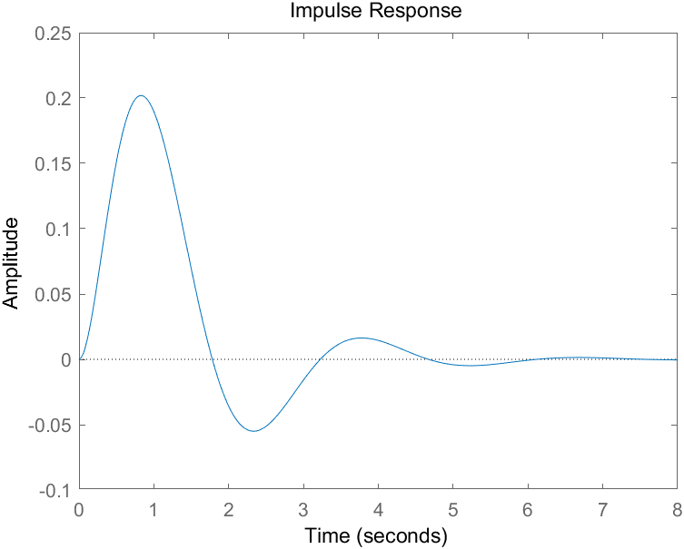
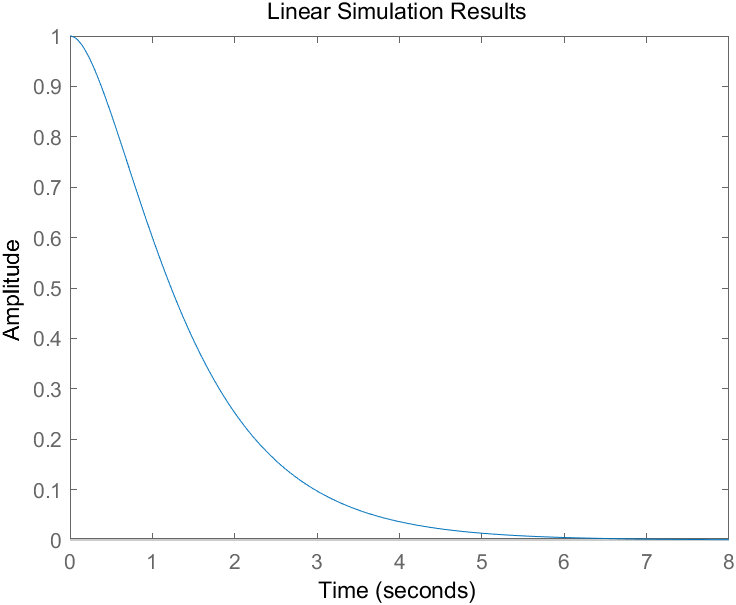
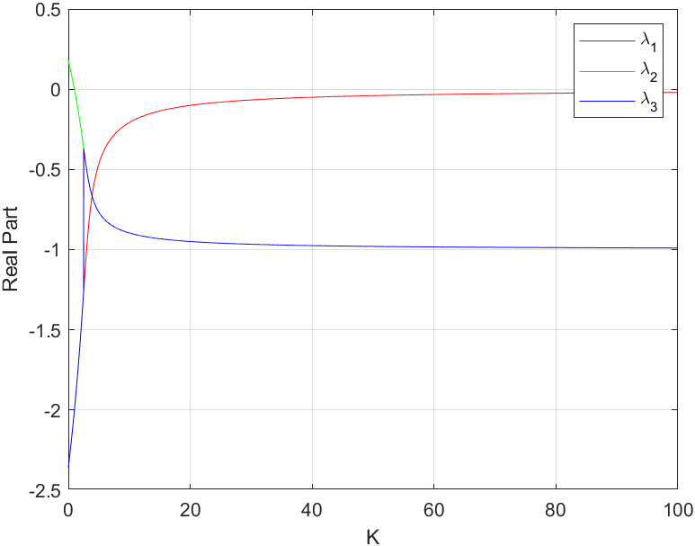
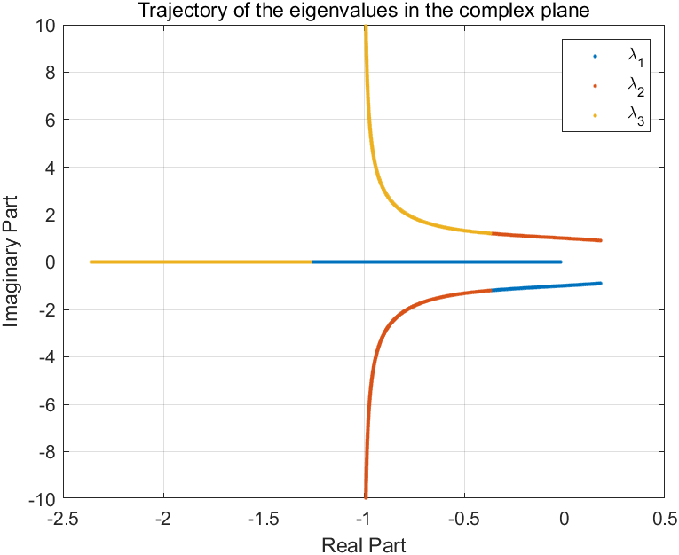

# State Space Simulation
This repository contains the code for the simulation of a state space model.

The state space model is a mathematical model that describes the behavior of a dynamic system. The state space model is defined by two equations:

$$
\dot{\mathbf{x}} = \mathbf{A}\mathbf{x} + \mathbf{B}\mathbf{u}
$$

$$
\mathbf{y} = \mathbf{C}\mathbf{x} + \mathbf{D}\mathbf{u}
$$

where the state equation describes the evolution of the state variables of the system over time, while the output equation describes the relationship between the state variables and the output of the system.

The state space model is widely used in control theory and signal processing to model the behavior of dynamic systems.

## File Structure
The repository contains two pdf files, [Computer Simulation Problems 1](./Computer%20Simulation%20Problems%201.pdf) and [Computer Simulation Problems 2](./Computer%20Simulation%20Problems%202.pdf), which contain the problems for the state space simulation. The problems cover a wide range of topics related to state space modeling and simulation, including state space representation, state space analysis, state space simulation, and state space control.

Solutions to the problems are provided in the [solutions](./solutions) directory. The solutions are implemented in MATLAB.

Each solution is contained in a separate MATLAB script file, which is named according to the problem number. For example, the solution to task 1 in problem 1 is provided in the file [P1_1.m](./solutions/P1_1.m).

## Figures
The [imgs](./imgs) directory contains the figures generated by the MATLAB scripts. The figures show the simulation results for some of the problems.

